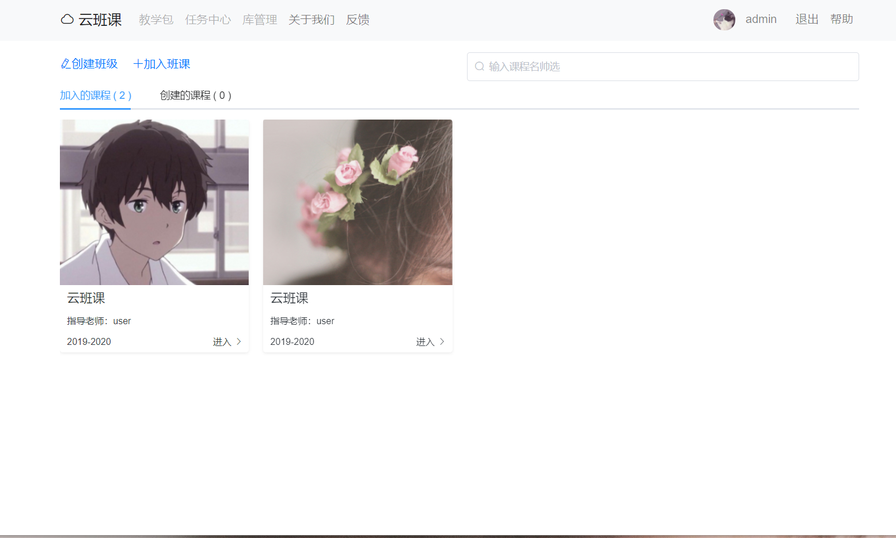
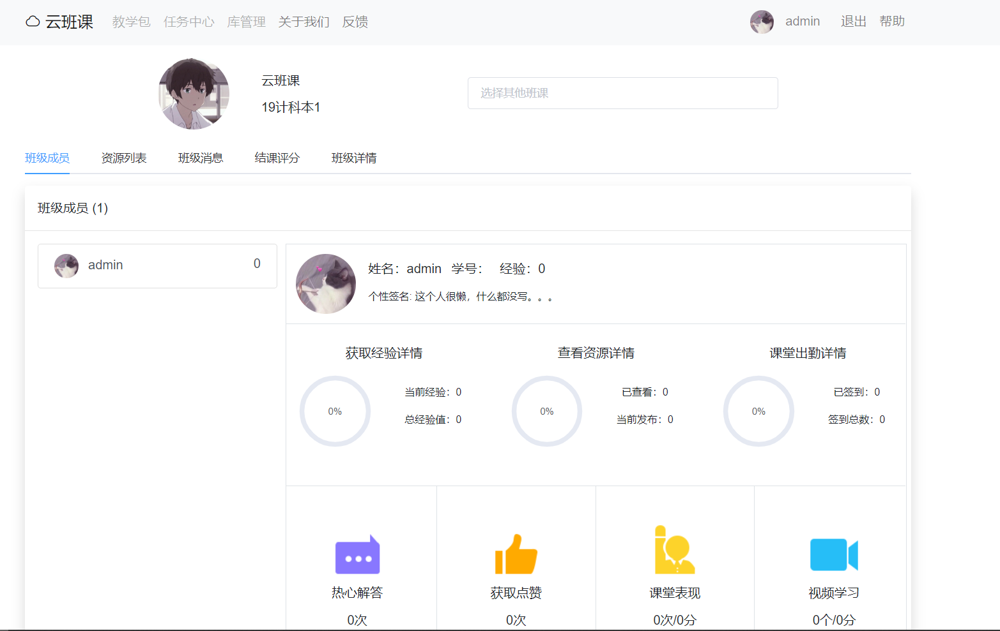
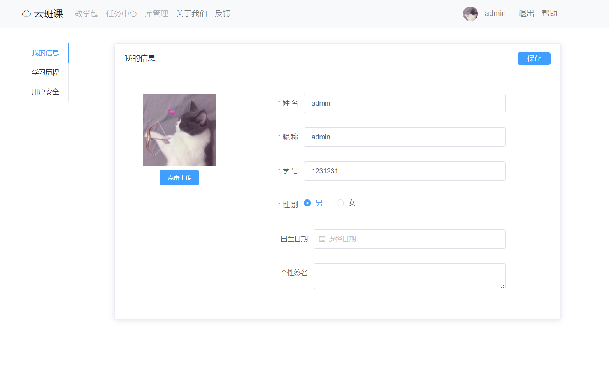

springboot+vue项目实战
=====================


### 项目简介
云班课就是为课程建立网站，教师可以在其上发布课程大纲、教学计划，以及每堂课的教学内容，布置作业，批改作业，公布学生成绩等。类似产品有[蓝墨云班课](https://www.mosoteach.cn/)、[学习通](http://i.chaoxing.com/vLoginPage)等。

### 使用技术
```
前端：vue + element-ui + bootstrap <br>
后端：springboot + shiro + mybatis + druid + mysql + redis
```

### 效果图
##### 课程页面


##### 班级页面


##### 个人信息页面


### 写在后面
第一次写这种综合性较强的项目，前期较难入手。[shimh博客](https://github.com/shimh-develop/blog-vue-springboot)在技术及规范对本项目的完成有很大的帮助。